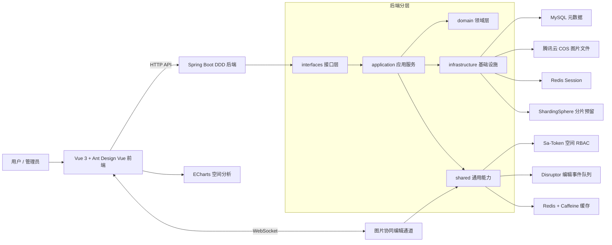
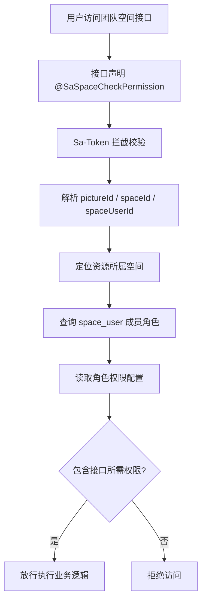
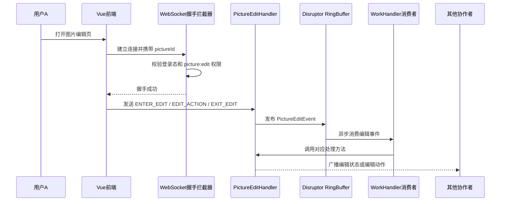
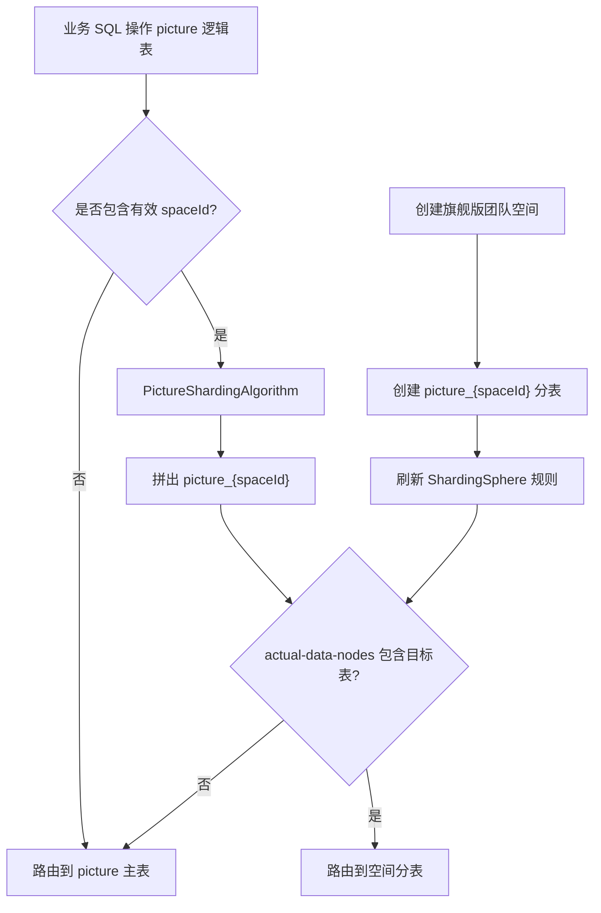
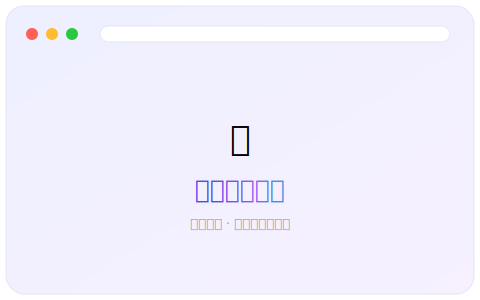
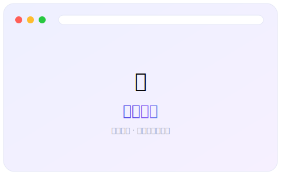
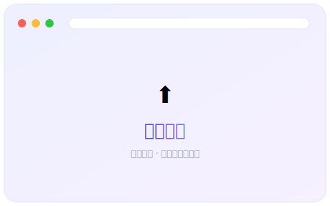
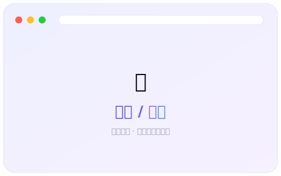

# 企业级智能协同云图库平台

基于 **Vue 3 + Spring Boot + DDD + COS + Sa-Token + WebSocket + Disruptor** 构建的智能协同云图库系统。项目不是简单的图片上传网站，而是围绕“图片数字资产管理”设计的一套完整业务平台，覆盖公共图库、私有空间、团队空间、权限协作、AI 图片处理、空间分析和实时协同编辑等场景。

这个项目适合作为后端秋招核心项目来讲：业务边界清晰，技术栈贴近企业应用，既有常规 CRUD，又包含权限模型、缓存优化、对象存储、实时通信、事件分发、分片扩展、DDD 分层等更能体现工程能力的设计。

---

## 项目定位

云图库的核心目标是帮助个人用户和团队管理图片资产。

| 使用场景 | 项目能力 |
| --- | --- |
| 公共素材图库 | 图片上传、检索、详情查看、分类标签、审核发布 |
| 个人图片空间 | 私有空间、容量限制、批量管理、图片编辑、空间分析 |
| 团队素材库 | 团队空间、成员邀请、角色权限、共享图片管理 |
| 企业协作场景 | WebSocket 实时协同编辑、成员操作隔离、空间级 RBAC |
| 智能图片工具 | AI 扩图、以图搜图、颜色搜索、主色调提取 |
| 运营和管理后台 | 用户管理、图片审核、空间管理、数据统计分析 |

一句话概括：

```text
这是一个面向个人和团队的图片资产管理平台，通过空间模型把图片存储、权限控制、协作编辑和数据分析统一起来。
```

---

## 系统架构图



---

## 核心功能

### 用户与账号体系

- 用户注册、登录、登出、登录态持久化。
- 基于 Spring Session + Redis 管理分布式 Session。
- 支持普通用户和系统管理员角色。
- 管理员可进行用户管理和后台审核操作。

### 图片资产管理

- 支持本地图片上传、URL 导入、批量抓取图片。
- 支持图片名称、简介、分类、标签等多条件检索。
- 支持图片编辑、删除、详情查看和审核流转。
- 使用腾讯云 COS 存储图片文件，MySQL 保存图片元数据。
- 支持缩略图、图片主色调、图片宽高、大小、格式等信息提取。

### 空间与团队协作

- 支持公共图库、私有空间、团队空间三类图片归属。
- 空间具备容量和数量限制，可按不同空间级别控制资源配额。
- 团队空间支持成员管理，成员可拥有 `viewer`、`editor`、`admin` 等角色。
- 团队成员基于空间角色进行差异化授权，保证不同空间之间的数据隔离。

### 空间级 RBAC 权限体系

- 系统权限和空间权限分离：系统管理员使用平台级角色，团队空间使用空间级角色。
- 基于 Sa-Token 扩展自定义 `space` 登录体系。
- 通过 `@SaSpaceCheckPermission` 注解声明接口所需空间权限。
- 通过 `space_user` 表记录用户在空间内的角色。
- 通过 `spaceUserAuthConfig.json` 维护角色和权限的映射关系。
- 在 `StpInterfaceImpl` 中根据请求上下文动态计算当前用户权限。

### 实时协同编辑

- 前端通过 WebSocket 建立图片协同编辑长连接。
- 后端在握手阶段校验登录态、团队空间和 `picture:edit` 权限。
- 按 `pictureId` 维护在线会话集合，实现图片维度的房间隔离。
- 通过 `ConcurrentHashMap` 维护当前正在编辑的用户，避免多人同时抢占编辑状态。
- 使用 Disruptor 将高频编辑消息封装成异步事件流。
- 支持进入编辑、退出编辑、旋转、缩放等编辑事件广播。

### 空间分析与可视化

- 支持空间使用量分析、分类分析、标签分析、大小分析。
- 支持空间用户行为分析和空间排行分析。
- 前端使用 ECharts 展示统计结果，帮助用户了解图片资产分布。

### 存储扩展与分片雏形

- 项目已引入 ShardingSphere-JDBC。
- 以 `spaceId` 作为图片表未来分片键，符合空间维度查询和隔离模型。
- 自定义 `PictureShardingAlgorithm`，预留 `picture_{spaceId}` 分表路由能力。
- 预留 `DynamicShardingManager`，用于未来创建旗舰版团队空间时动态建表并刷新分片规则。
- 当前为了降低部署复杂度，动态分表链路暂未启用，属于可演进的分片架构雏形。

---

## 技术栈

### 后端

| 技术 | 用途 |
| --- | --- |
| Java 8 | 后端主语言 |
| Spring Boot 2.7.6 | Web 应用基础框架 |
| MyBatis-Plus | ORM、分页、条件构造、逻辑删除 |
| MySQL | 核心业务数据存储 |
| Redis | Session、缓存、权限相关状态扩展 |
| Spring Session | 分布式登录态管理 |
| Sa-Token | 登录认证和权限校验 |
| Caffeine | 本地缓存 |
| Tencent COS | 图片对象存储 |
| WebSocket | 协同编辑实时通信 |
| Disruptor | 高性能编辑事件队列 |
| ShardingSphere-JDBC | 图片表按空间分片的扩展预留 |
| Knife4j | 接口文档 |
| Hutool / Jsoup | 工具能力、网页图片解析 |

### 前端

| 技术 | 用途 |
| --- | --- |
| Vue 3 | 前端框架 |
| TypeScript | 类型约束 |
| Vite | 构建工具 |
| Ant Design Vue | UI 组件库 |
| Pinia | 状态管理 |
| Vue Router | 路由管理 |
| Axios | HTTP 请求 |
| ECharts | 数据可视化 |
| vue-cropper | 图片裁剪编辑 |
| @umijs/openapi | 接口代码生成 |

---

## 架构设计

项目包含两个后端版本，其中推荐以 `mjy-picture-backend-ddd` 作为主线理解和展示。

```text
mjy_picture_ai
├── mjy-picture-backend          # 传统分层后端版本
├── mjy-picture-backend-ddd      # DDD 分层后端版本，推荐作为主项目讲解
├── mjy-picture-frontend         # Vue 3 前端项目
├── docs                         # 项目架构与面试准备文档
└── README.md                    # 项目展示入口
```

DDD 后端按职责拆分为：

| 分层 | 职责 |
| --- | --- |
| `interfaces` | Controller、DTO、VO、Assembler，对外提供 HTTP 接口 |
| `application` | 应用服务，编排业务流程、事务和跨领域协作 |
| `domain` | 领域实体、领域服务、值对象，承载核心业务规则 |
| `infrastructure` | Mapper、数据库访问、外部服务、持久化实现 |
| `shared` | 通用能力，如权限、缓存、WebSocket、分片、异常处理 |

这种拆分的价值是：

```text
Controller 不直接堆业务逻辑
应用服务负责编排流程
领域层沉淀核心规则
基础设施层隔离数据库和第三方服务
shared 层沉淀可复用工程能力
```

---

## 核心业务链路

### 图片上传链路

```text
用户选择图片
-> 后端校验登录态和空间权限
-> 校验文件格式和大小
-> 上传图片到腾讯云 COS
-> 解析图片元信息
-> 保存图片元数据到 MySQL
-> 更新空间容量和图片数量
-> 返回图片 VO 给前端展示
```

### 团队空间权限链路



### 协同编辑事件链路



### 分片扩展链路设想



---

## 工程亮点

| 亮点 | 说明 |
| --- | --- |
| DDD 分层改造 | 将接口、应用、领域、基础设施和通用能力拆开，避免业务逻辑堆在 Controller |
| 空间级 RBAC | 用 Sa-Token + 自定义权限注解 + `space_user` 表实现团队空间角色权限体系 |
| 实时协同编辑 | WebSocket 维护长连接，Disruptor 异步分发编辑事件，支持图片级房间广播 |
| 多级缓存思路 | Redis 管理分布式 Session，Caffeine 支持本地热点缓存扩展 |
| 对象存储接入 | 图片文件存储在 COS，数据库只保存元数据，符合真实业务架构 |
| 空间容量控制 | 按空间级别限制容量和数量，具备 SaaS 配额模型雏形 |
| 分片扩展预留 | ShardingSphere 已接入，按 `spaceId` 预留图片表分片能力 |
| 数据分析能力 | 空间用量、分类、标签、大小、成员行为、排行榜等多维统计分析 |
| 前后端类型协作 | 前端通过 OpenAPI 生成接口类型，降低接口联调成本 |

---

## 界面展示

> 平台核心页面预览（当前为统一风格占位图，替换为真实截图后即生效）。图片统一存放在 `docs/screenshots/` 目录，可按需增删。

<table>
  <tr>
    <td align="center" width="50%">
      <br/>
      <sub><b>公共图库首页</b> · 图片瀑布流、分类标签与多条件检索</sub>
    </td>
    <td align="center" width="50%">
      <br/>
      <sub><b>图片详情</b> · 大图预览、元信息展示与编辑入口</sub>
    </td>
  </tr>
  <tr>
    <td align="center" width="50%">
      <br/>
      <sub><b>图片上传</b> · 本地上传 / URL 导入 / 批量抓取</sub>
    </td>
    <td align="center" width="50%">
      <br/>
      <sub><b>空间分析</b> · ECharts 多维度统计可视化</sub>
    </td>
  </tr>
  <tr>
    <td align="center" width="50%">
      <br/>
      <sub><b>团队空间</b> · 成员管理与空间级权限协作</sub>
    </td>
    <td align="center" width="50%">
      <br/>
      <sub><b>登录 / 注册</b> · 卡片化界面与统一主题风格</sub>
    </td>
  </tr>
</table>

---

## 运行项目

### 环境要求

- JDK 8
- Maven 3.x
- Node.js 18+ 或 20+
- MySQL 8.x
- Redis 6.x+
- 腾讯云 COS 配置，可按需填写

### 后端启动

推荐启动 DDD 版本后端：

```bash
cd mjy-picture-backend-ddd
mvn spring-boot:run
```

默认接口地址：

```text
http://localhost:8123/api
```

主要配置文件：

```text
mjy-picture-backend-ddd/src/main/resources/application.yml
```

数据库初始化脚本：

```text
mjy-picture-backend-ddd/sql/create_table.sql
```

### 前端启动

```bash
cd mjy-picture-frontend
npm install
npm run dev
```

常用脚本：

| 命令 | 说明 |
| --- | --- |
| `npm run dev` | 启动开发环境 |
| `npm run build` | 类型检查并构建生产包 |
| `npm run pure-build` | 仅执行 Vite 构建 |
| `npm run openapi` | 根据后端接口生成前端 API 代码 |
| `npm run lint` | 执行 ESLint 修复 |
