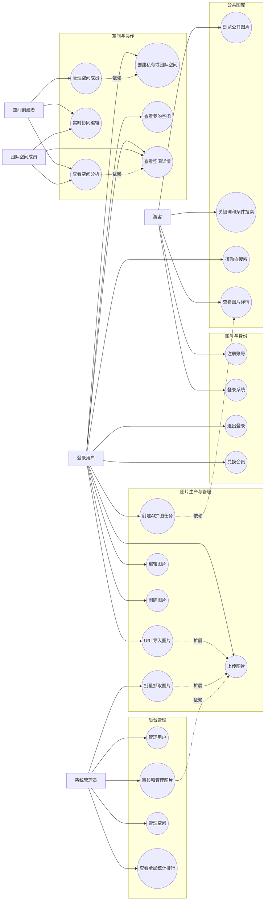
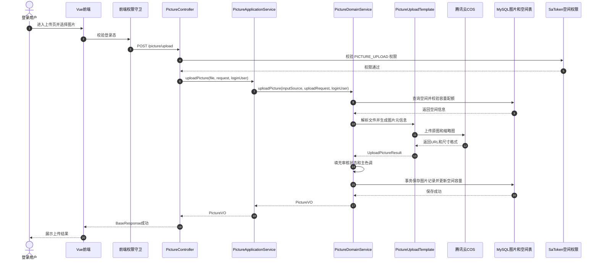
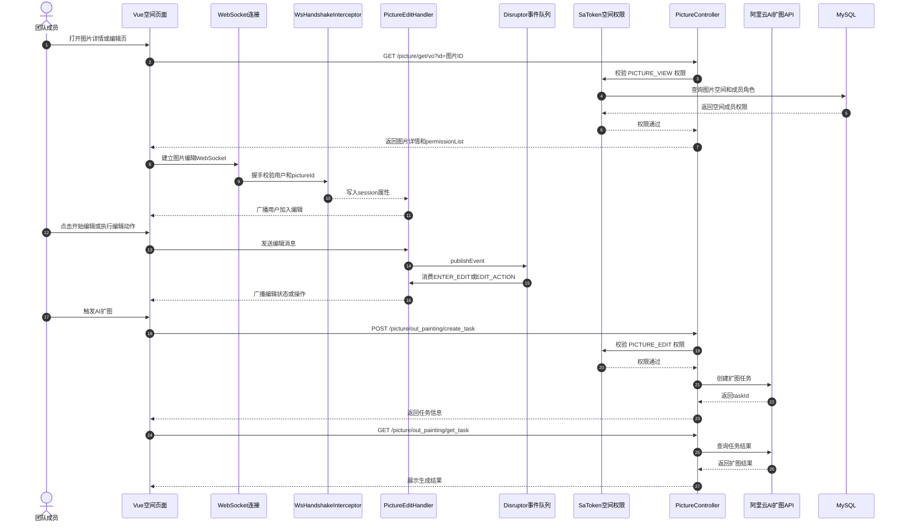
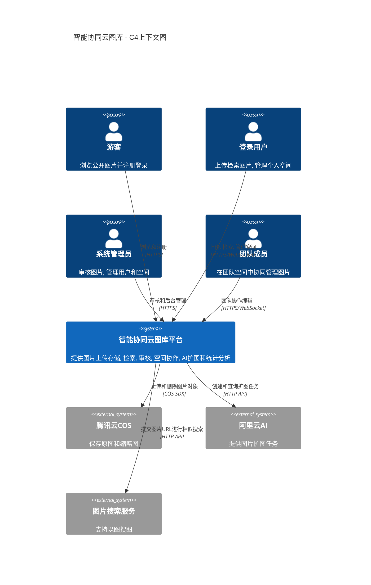
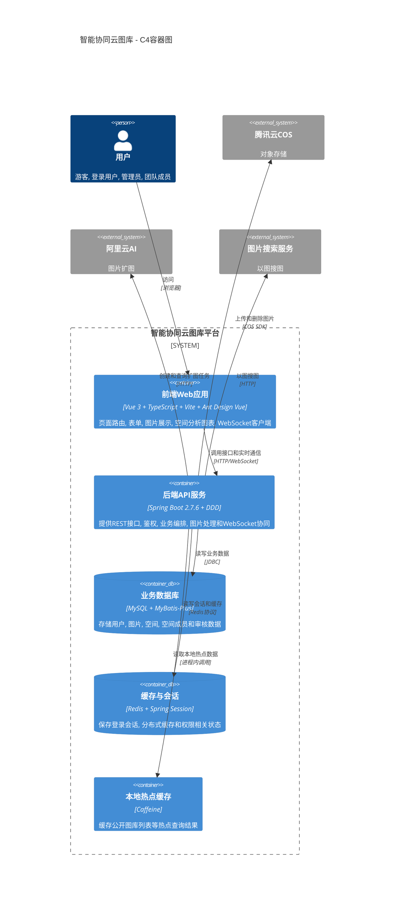
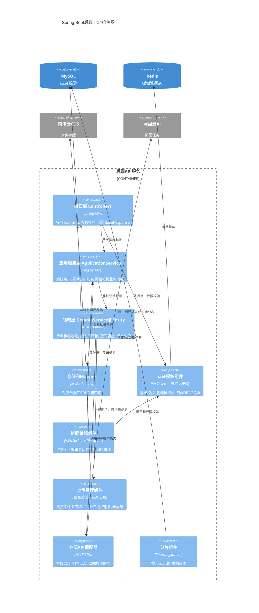
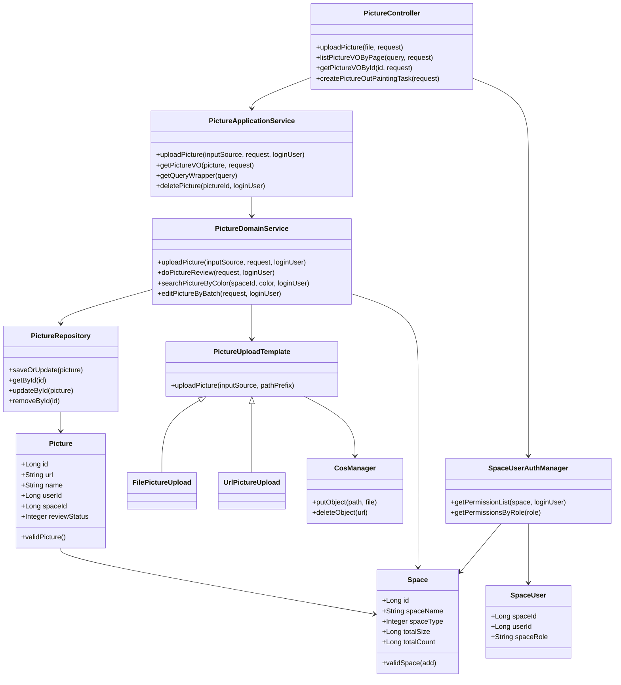

# 云图库项目全景架构与业务拆解

本文基于 `mjy-picture-backend-ddd`、`mjy-picture-frontend` 和项目真实代码整理，用于从零理解智能协同云图库项目的业务定位、功能设计、核心流程与技术架构。

---

## 1. 项目核心定位与业务拆解

这个项目本质上是一个 **企业级智能协同云图库平台**。通俗说，它不是单纯“上传图片的网站”，而是把图片当作企业或个人的数字资产来管理：用户可以上传、检索、分类、编辑图片；管理员可以审核内容；团队可以创建共享空间并邀请成员协同管理图片；系统还接入了 AI 扩图、以图搜图、空间统计分析等增强能力。

它解决的核心业务问题是：

| 问题 | 项目里的解决方式 |
| --- | --- |
| 图片太多不好找 | 支持名称、简介、分类、标签、颜色、以图搜图 |
| 图片资源需要隔离 | 公共图库、私有空间、团队空间三种归属 |
| 企业团队需要协作 | 团队空间、成员角色、WebSocket 实时协同编辑 |
| 内容需要治理 | 管理员审核图片，通过后才进入公开图库 |
| 存储和容量要管控 | COS 存图片，MySQL 存元数据，空间有容量和数量限制 |
| 运营需要数据分析 | 按容量、分类、标签、大小、用户行为、空间排行分析 |

目标用户可以分成 4 类：

| 角色 | 能做什么 |
| --- | --- |
| 游客 | 浏览公开图库、搜索图片、注册登录 |
| 普通登录用户 | 上传图片、创建空间、管理自己的图片、使用 AI 扩图 |
| 团队空间成员 | 在团队空间中按角色查看、上传、编辑、管理成员 |
| 系统管理员 | 管理用户、审核图片、管理空间、查看全局分析 |

核心功能模块：

| 模块 | 对应业务 | 代表代码 |
| --- | --- | --- |
| 用户模块 | 注册、登录、登出、管理员用户管理 | `UserController` |
| 图片模块 | 上传、URL 导入、编辑、删除、搜索、审核、AI 扩图 | `PictureController` |
| 空间模块 | 创建私有/团队空间、容量限制、空间详情 | `SpaceController` |
| 空间成员模块 | 添加成员、移除成员、修改角色、查看我的团队空间 | `SpaceUserController` |
| 空间分析模块 | 使用量、分类、标签、大小、用户行为、排行 | `SpaceAnalyzeController` |
| 权限模块 | 管理员权限、空间 RBAC 权限 | `SpaceUserAuthManager`、`StpInterfaceImpl` |
| 协同编辑模块 | WebSocket 连接、编辑事件广播、Disruptor 队列 | `PictureEditHandler` |

---

## 2. 用例图分析



用例解读：

| 角色 | 说明 |
| --- | --- |
| 游客 | 没登录也能看公开图库，但不能上传、创建空间、编辑图片 |
| 登录用户 | 是系统的基础业务用户，可以上传图片、创建空间、查看详情、搜索、AI 扩图 |
| 空间创建者 | 创建团队空间后自动成为空间管理员，可以管理成员 |
| 团队成员 | 权限取决于 `viewer / editor / admin` 角色 |
| 系统管理员 | 拥有后台管理能力，包括用户、图片审核、空间管理、全局排行 |

空间权限不是简单的“是否登录”，而是 **空间 RBAC**：用户在某个空间里有一个角色，角色对应一组权限。

---

## 3. 核心业务时序图分析

### 3.1 图片上传、COS 存储、数据库落库、空间容量更新



流程重点：

- 前端发起 `/picture/upload`。
- Controller 只做入参接收、登录用户获取、权限入口。
- ApplicationService 做业务编排。
- DomainService 真正处理图片上传规则、空间容量、审核状态。
- `PictureUploadTemplate` 是模板方法，文件上传和 URL 上传分别由 `FilePictureUpload`、`UrlPictureUpload` 扩展。
- 图片文件放 COS，图片元数据放 MySQL。
- 如果图片属于某个空间，会同步更新 `space.totalSize` 和 `space.totalCount`。

### 3.2 团队空间协作编辑与 AI 扩图



这里要注意一个真实实现边界：当前协同编辑状态主要存在后端内存 Map 中，适合单机部署；如果未来多实例部署，需要把编辑锁、在线会话、广播能力迁到 Redis 或消息中间件。

---

## 4. C4 分层架构拆解

### 4.1 Level 1：系统上下文图



上下文层看的是业务边界：系统服务内部用户，同时依赖 COS、阿里云 AI、图片搜索服务。

### 4.2 Level 2：容器图



容器层的运行逻辑：

- 浏览器访问 Vue 前端。
- 前端通过 HTTP 调后端 REST API，通过 WebSocket 做协同编辑。
- 后端用 MySQL 存业务数据，用 Redis 存 Session 和缓存，用 Caffeine 做本地热点缓存。
- 图片文件本身不进数据库，而是上传到 COS。
- AI 扩图和以图搜图是外部 API 能力。

### 4.3 Level 3：组件图



后端 DDD 分层：

| 层 | 包 | 职责 |
| --- | --- | --- |
| 接口层 | `interfaces` | Controller、DTO、VO、Assembler |
| 应用层 | `application` | 编排业务流程，不沉淀太多规则 |
| 领域层 | `domain` | 用户、图片、空间、空间成员的核心业务规则 |
| 基础设施层 | `infrastructure` | Mapper、COS、AI API、异常、配置、工具 |
| 共享层 | `shared` | 认证授权、WebSocket、分片等横切能力 |

### 4.4 Level 4：代码层



代码层的核心思想：

- Controller 不直接操作数据库。
- ApplicationService 负责调度。
- DomainService 负责业务规则。
- Repository/Mapper 负责数据读写。
- UploadTemplate 抽象上传流程，文件上传和 URL 上传复用同一套主流程。

---

## 5. 数据模型与运行机制总结

数据库核心表：

| 表 | 含义 |
| --- | --- |
| `user` | 用户账号、密码、昵称、头像、角色、会员信息 |
| `picture` | 图片元信息，包含 URL、分类、标签、大小、宽高、审核状态、所属空间 |
| `space` | 空间信息，包含空间等级、容量上限、图片数量、空间类型 |
| `space_user` | 团队空间成员关系，决定某个用户在某个空间里的角色 |

图片文件和数据库不是一回事：

```text
COS：保存真实图片文件、缩略图
MySQL picture 表：保存图片 URL、名称、标签、大小、审核状态、空间 ID
```

权限机制分两层：

```text
系统角色：user / admin
空间角色：viewer / editor / admin
```

系统管理员能做后台管理；空间角色只在某个团队空间内生效。比如某用户在 A 空间是 admin，但在 B 空间可能没有权限。

当前真实实现里已经具备的亮点：

- DDD 分层结构清楚。
- 图片上传使用模板方法，文件上传和 URL 上传能复用流程。
- Sa-Token + 自定义空间权限，实现了团队空间 RBAC。
- WebSocket + Disruptor 支持协同编辑事件分发。
- Redis + Caffeine 依赖已接入，存在多级缓存示例。
- ShardingSphere 已引入，并有按 `spaceId` 分片的算法雏形。
- 接入 COS、阿里云 AI、以图搜图等外部能力。

需要实事求是知道的边界：

- 当前多级缓存接口在 `PictureController` 里标了 `@Deprecated`，说明还不是最终主链路。
- 动态分表管理器 `DynamicShardingManager` 当前注释了组件注册，分表能力是有设计雏形，不是完整生产闭环。
- WebSocket 协同编辑状态现在主要是单机内存结构，集群部署需要 Redis 或消息总线补强。
- 异步能力目前主要体现在 `@Async` 清理文件，上传后的压缩、审核、AI 任务还没有完整任务表状态机。

---

## 6. 项目全景总结

这个项目可以用一句话概括：

> 它是一个围绕图片资产管理构建的云图库平台，以 Spring Boot 后端和 Vue 前端为主体，支持公开图库、私有空间、团队空间、图片审核、图片搜索、AI 扩图、空间分析和实时协作。

从用户视角看：

```text
用户注册登录
-> 上传图片或 URL 导入
-> 图片进入公共图库或某个空间
-> 系统保存图片文件到 COS，保存图片元数据到 MySQL
-> 管理员审核公共图片
-> 用户按名称、分类、标签、颜色、图片相似度搜索
-> 团队空间成员按角色协同编辑和管理图片
-> 空间管理员查看容量、分类、标签、用户行为等分析数据
```

从技术视角看：

```text
Vue 前端
-> Spring Boot Controller
-> ApplicationService 编排业务
-> DomainService 执行业务规则
-> Repository / Mapper 读写 MySQL
-> Redis / Caffeine 处理会话和缓存
-> COS 保存图片文件
-> WebSocket + Disruptor 处理协同编辑
-> 阿里云 AI 和图片搜索服务提供增强能力
```

从面试表达视角看，这个项目最值得抓住的主线不是“做了图片上传”，而是：

```text
图片资产管理 + 空间权限隔离 + 团队协作 + 图片处理链路 + 缓存与分片优化雏形 + AI 能力接入
```

这就是它从普通 CRUD 项目升级为后端项目的核心价值。
